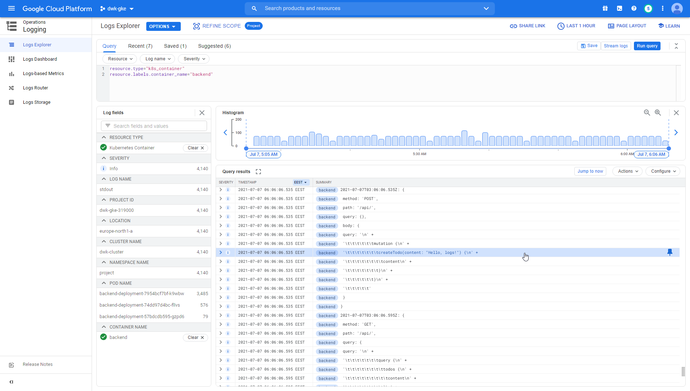

# 3.01

```sh
kekalainen@Z97:~$ gcloud config set project dwk-gke-319000
Updated property [core/project].
```

```sh
kekalainen@Z97:~$ gcloud services enable container.googleapis.com
```

```sh
kekalainen@Z97:~$ gcloud container clusters create dwk-cluster --zone=europe-north1b
...
Creating cluster dwk-cluster in europe-north1-a...
...
NAME         LOCATION         MASTER_VERSION    MASTER_IP      MACHINE_TYPE  NODE_VERSION      NUM_NODES  STATUS
dwk-cluster  europe-north1-a  1.19.10-gke.1600  35.228.x.x     e2-medium     1.19.10-gke.1600  3          RUNNING
```

```sh
kekalainen@Z97:~$ gcloud container clusters get-credentials dwk-cluster --zone=europe-north1-a
Fetching cluster endpoint and auth data.
kubeconfig entry generated for dwk-cluster.
```

```sh
kekalainen@Z97:~$ kubectl config use-context k3d-k3s-default
Switched to context "k3d-k3s-default".
kekalainen@Z97:~$ kubectl get secret -n kube-system -l sealedsecrets.bitnami.com/sealed-secrets-key -o yaml > master.key
kekalainen@Z97:~$ kubectl config use-context gke_dwk-gke-319000_europe-north1-a_dwk-cluster
Switched to context "gke_dwk-gke-319000_europe-north1-a_dwk-cluster".
kekalainen@Z97:~$ kubectl apply -f ./master.key
secret/sealed-secrets-keysdr97 created
kekalainen@Z97:~$ kubectl apply -f https://github.com/bitnami-labs/sealed-secrets/releases/download/v0.16.0/controller.yaml
...
```

```sh
kekalainen@Z97:~$ kubectl create namespace main
namespace/main created
kekalainen@Z97:~$ kubectl apply -f ./ping-pong-app/manifests
service/postgres-service created
statefulset.apps/postgres-statefulset created
deployment.apps/ping-pong-deployment created
sealedsecret.bitnami.com/postgres-secret created
service/ping-pong-service created
```

```sh
kekalainen@Z97:~$ kubectl get services -n main
NAME                TYPE           CLUSTER-IP      EXTERNAL-IP   PORT(S)        AGE
ping-pong-service   LoadBalancer   10.59.242.147   34.88.x.x     80:31268/TCP   63s
postgres-service    ClusterIP      None            <none>        5432/TCP       63s
```

```sh
kekalainen@Z97:~$ curl 34.88.x.x
pong 0
```

# 3.02

```sh
kekalainen@Z97:~$ kubectl apply -f ./main-app/manifests/ -f ./ping-pong-app/manifests/ -f ./manifests/ingress.yaml
configmap/hashgenerator-configmap created
deployment.apps/hashgenerator-deployment created
persistentvolumeclaim/hashgenerator-persistent-volume-claim created
service/hashgenerator-service created
service/postgres-service unchanged
statefulset.apps/postgres-statefulset configured
deployment.apps/ping-pong-deployment unchanged
sealedsecret.bitnami.com/postgres-secret unchanged
service/ping-pong-service configured
ingress.networking.k8s.io/ingress created
```

```sh
kekalainen@Z97:~$ kubectl get ingress -n main
NAME      CLASS    HOSTS   ADDRESS          PORTS   AGE
ingress   <none>   *       34.149.x.x       80      18m
kekalainen@Z97:~$ curl 34.149.x.x/pingpong
pong 8
kekalainen@Z97:~$ curl 34.149.x.x/main
Hello
2021-07-06T05:10:20.028Z: fb7w019x6fu
Ping / Pongs: 9
kekalainen@Z97:~$     
```

# 3.03

```sh
kekalainen@Z97:~$ kubectl create namespace project
namespace/project created
```

```sh
kekalainen@Z97:~$ gcloud iam service-accounts list
DISPLAY NAME                            EMAIL                                               DISABLED
Compute Engine default service account  xxxxxxxxxxxx-compute@developer.gserviceaccount.com  False
kekalainen@Z97:~$ gcloud iam service-accounts keys create sa-private-key.json --iam-account xxxxxxxxxxxx-compute@developer.gserviceaccount.com
created key [xxxxxxxxxxxxxxxxxxxxxxxxxxxxxxxxxxxxxxxx] of type [json] as [sa-private-key.json] for [xxxxxxxxxxxx-compute@developer.gserviceaccount.com]
```

# 3.04

See commits and branches.

`~/project-app/backend/manifests/secret.yaml`

```yaml
apiVersion: v1
kind: Secret
metadata:
  namespace: project
  name: postgres-secret
data:
  POSTGRES_PASSWORD: <redacted>
```

```sh
kekalainen@Z97:~$ kubeseal --scope cluster-wide -o yaml < ./project-app/backend/manifests/secret.yaml > ./project-app/backend/manifests/postgres-sealedsecret.yaml 
```

# 3.05

See commits and workflow runs.

# 3.06

See [`README.md`](./README.md).

# 3.07

See [`README.md`](./README.md).

# 3.08

```sh
root@18560eedb645:/# ab -n 10000 -c 100 http://34.149.xxx.xxx/
This is ApacheBench, Version 2.3 <$Revision: 1843412 $>
Copyright 1996 Adam Twiss, Zeus Technology Ltd, http://www.zeustech.net/
Licensed to The Apache Software Foundation, http://www.apache.org/

Benchmarking 34.149.xxx.xxx (be patient)
Completed 1000 requests
...
Finished 10000 requests

...

Concurrency Level:      100
Time taken for tests:   83.813 seconds
Complete requests:      10000
Failed requests:        1
   (Connect: 0, Receive: 0, Length: 1, Exceptions: 0)
Non-2xx responses:      1
Total transferred:      14549033 bytes
HTML transferred:       11679164 bytes
Requests per second:    119.31 [#/sec] (mean)
Time per request:       838.130 [ms] (mean)
Time per request:       8.381 [ms] (mean, across all concurrent requests)
Transfer rate:          169.52 [Kbytes/sec] received

...
```
The test above peaked at approximately 70 millicpu and 30 mebibytes (frontend deployment).

# 3.09

See commits.

# 3.10


