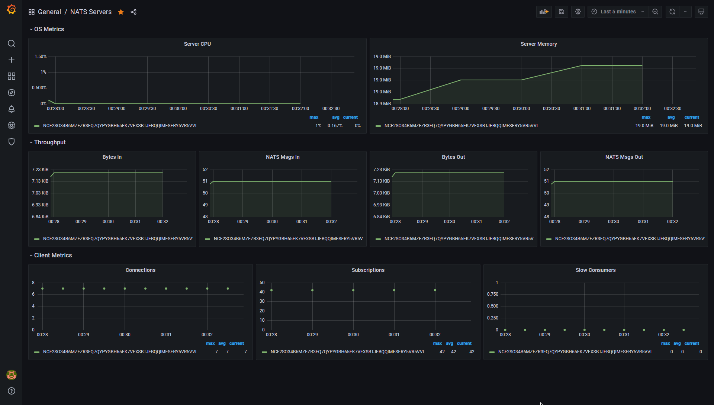
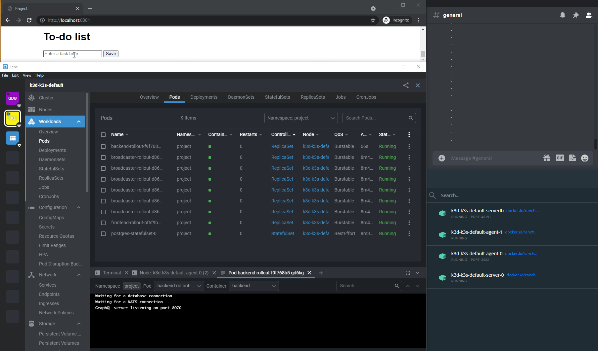

## 4.01

```sh
kekalainen@Z97:~$ kubectl config use-context k3d-k3s-default
Switched to context "k3d-k3s-default".
```

```sh
kekalainen@Z97:~$ kubectl apply -f ./manifests/ingress.yaml 
ingress.networking.k8s.io/ingress created
kekalainen@Z97:~$ kubectl apply -f ./main-app/manifests/
configmap/hashgenerator-configmap created
deployment.apps/hashgenerator-deployment created
persistentvolumeclaim/hashgenerator-persistent-volume-claim created
service/hashgenerator-service created
kekalainen@Z97:~$ kubectl apply -f ./ping-pong-app/manifests/deployment.yaml -f ./ping-pong-app/manifests/sealedsecret.yaml -f ./ping-pong-app/manifests/service.yaml 
deployment.apps/ping-pong-deployment created
sealedsecret.bitnami.com/postgres-secret created
service/ping-pong-service created
```

```sh
kekalainen@Z97:~$ kubectl get pods -n main
NAME                                        READY   STATUS    RESTARTS   AGE
hashgenerator-deployment-6845d4fc6f-n7ddz   1/2     Running   0          34s
ping-pong-deployment-7767b5d5f5-r7ldq       0/1     Running   0          26s
```

```sh
kekalainen@Z97:~$ kubectl apply -f ./ping-pong-app/manifests/database.yaml 
service/postgres-service created
statefulset.apps/postgres-statefulset created
```

```sh
kekalainen@Z97:~$ kubectl get pods -n main
NAME                                        READY   STATUS    RESTARTS   AGE
hashgenerator-deployment-6845d4fc6f-n7ddz   1/2     Running   0          118s
ping-pong-deployment-7767b5d5f5-r7ldq       0/1     Running   0          110s
postgres-statefulset-0                      0/1     Pending   0          4s
kekalainen@Z97:~$ kubectl get pods -n main
NAME                                        READY   STATUS    RESTARTS   AGE
postgres-statefulset-0                      1/1     Running   0          26s
ping-pong-deployment-7767b5d5f5-r7ldq       1/1     Running   0          2m12s
hashgenerator-deployment-6845d4fc6f-n7ddz   2/2     Running   0          2m20s
```

## 4.02

`~/project-app/backend/manifests/deployment.yaml`

```yaml
...
          image: BACKEND_IMAGE
          ports:
            - containerPort: 8070
          #envFrom:
          #  - secretRef:
          #      name: postgres-secret
...
```

```sh
kekalainen@Z97:~$ kubectl apply -k ./project-app/                                                   
service/backend-service created
service/frontend-service created
service/postgres-service created
deployment.apps/backend-deployment created
deployment.apps/frontend-deployment created
statefulset.apps/postgres-statefulset created
cronjob.batch/daily-todo-cronjob created
sealedsecret.bitnami.com/postgres-secret created
ingress.networking.k8s.io/ingress created
```

```sh
kekalainen@Z97:~$ kubectl get pods -n project
NAME                                  READY   STATUS    RESTARTS   AGE
backend-deployment-557ddc5bdf-tgl2v   0/1     Running   0          22s
postgres-statefulset-0                1/1     Running   0          22s
frontend-deployment-c6444cf86-zqsqr   1/1     Running   0          22s
```

`~/project-app/backend/manifests/deployment.yaml`

```yaml
...
          image: BACKEND_IMAGE
          ports:
            - containerPort: 8070
          envFrom:
            - secretRef:
                name: postgres-secret
...
```

```sh
kekalainen@Z97:~$ kubectl apply -k ./project-app/
...
deployment.apps/backend-deployment configured
...
```

```sh
kekalainen@Z97:~$ kubectl get pods -n project
NAME                                  READY   STATUS        RESTARTS   AGE
postgres-statefulset-0                1/1     Running       0          110s
frontend-deployment-c6444cf86-zqsqr   1/1     Running       0          110s
backend-deployment-6d4dcfcc66-qf4m8   1/1     Running       0          33s
backend-deployment-557ddc5bdf-tgl2v   0/1     Terminating   1          110s
```

## 4.03

```sh
kekalainen@Z97:~$ kubectl get pods -n prometheus | grep prometheus-kube
prometheus-kube-prometheus-stack-1625-prometheus-0                2/2     Running   9          5d7h
kekalainen@Z97:~$ kubectl port-forward -n prometheus prometheus-kube-prometheus-stack-1625-prometheus-0 9090:9090
Forwarding from 127.0.0.1:9090 -> 9090
Forwarding from [::1]:9090 -> 9090
```

```promql
scalar(sum(kube_pod_info{namespace="prometheus", created_by_kind="StatefulSet"}))
```

```sh
kekalainen@Z97:~$ curl http://localhost:9090/api/v1/query?query=scalar%28sum%28kube_pod_info%7Bnamespace%3D%22prometheus%22%2C+created_by_kind%3D%22StatefulSet%22%7D%29%29
{"status":"success","data":{"resultType":"scalar","result":[1625708315.557,"2"]}}
```

## 4.04

```sh
kekalainen@Z97:~$ kubectl create namespace argo-rollouts
namespace/argo-rollouts created
kekalainen@Z97:~$ kubectl apply -n argo-rollouts -f https://github.com/argoproj/argo-rollouts/releases/latest/download/install.yaml
customresourcedefinition.apiextensions.k8s.io/analysisruns.argoproj.io created
customresourcedefinition.apiextensions.k8s.io/analysistemplates.argoproj.io created
customresourcedefinition.apiextensions.k8s.io/clusteranalysistemplates.argoproj.io created
customresourcedefinition.apiextensions.k8s.io/experiments.argoproj.io created
customresourcedefinition.apiextensions.k8s.io/rollouts.argoproj.io created
serviceaccount/argo-rollouts created
clusterrole.rbac.authorization.k8s.io/argo-rollouts-aggregate-to-admin created
clusterrole.rbac.authorization.k8s.io/argo-rollouts-aggregate-to-edit created
clusterrole.rbac.authorization.k8s.io/argo-rollouts-aggregate-to-view created
clusterrole.rbac.authorization.k8s.io/argo-rollouts-clusterrole created
clusterrolebinding.rbac.authorization.k8s.io/argo-rollouts-clusterrolebinding created
service/argo-rollouts-metrics created
deployment.apps/argo-rollouts created
```

```sh
kekalainen@Z97:~$ kubectl delete namespace project
namespace "project" deleted
kekalainen@Z97:~$ kubectl create namespace project
namespace/project created
kekalainen@Z97:~$ kubectl apply -k ./project-app/
service/backend-service created
service/frontend-service created
service/postgres-service created
statefulset.apps/postgres-statefulset created
cronjob.batch/daily-todo-cronjob created
analysistemplate.argoproj.io/cpu-usage created
rollout.argoproj.io/backend-rollout created
rollout.argoproj.io/frontend-rollout created
sealedsecret.bitnami.com/postgres-secret created
ingress.networking.k8s.io/ingress created
```

`~/project-app/backend/manifests/analysistemplate.yaml`

```yaml
...
    initialDelay: 1m
    successCondition: result < 0.0005
...
        query: scalar(sum(rate(container_cpu_usage_seconds_total{namespace="project"}[1m])))
```

`~/project-app/kustomization.yaml`

```yaml
...
- name: FRONTEND_IMAGE
  newName: kekalainen/uh-devops-with-kubernetes:1.02
```

```sh
kekalainen@Z97:~$ kubectl apply -k ./project-app/
service/backend-service unchanged
service/frontend-service unchanged
service/postgres-service unchanged
statefulset.apps/postgres-statefulset configured
cronjob.batch/daily-todo-cronjob unchanged
analysistemplate.argoproj.io/cpu-usage configured
rollout.argoproj.io/backend-rollout configured
rollout.argoproj.io/frontend-rollout configured
sealedsecret.bitnami.com/postgres-secret unchanged
ingress.networking.k8s.io/ingress unchanged
```

```sh
kekalainen@Z97:~$ kubectl describe rollout frontend-rollout -n project
Name:         frontend-rollout
Namespace:    project
Labels:       <none>
Annotations:  rollout.argoproj.io/revision: 2
API Version:  argoproj.io/v1alpha1
Kind:         Rollout
...
Status:
...
  Canary:
    Current Step Analysis Run Status:
      Message:  metric "cpu-usage" assessed Failed due to failed (1) > failureLimit (0)
      Name:     frontend-rollout-6f488cc88d-2-1
      Status:   Failed
...
Events:
  Type     Reason                Age    From                 Message
  ----     ------                ----   ----                 -------
  Normal   RolloutUpdated        2m41s  rollouts-controller  Rollout updated to revision 1
  Normal   NewReplicaSetCreated  2m41s  rollouts-controller  Created ReplicaSet frontend-rollout-7fc65cb7fb (revision 1) with size 1
  Normal   RolloutCompleted      2m41s  rollouts-controller  Rollout completed update to revision 1 (7fc65cb7fb): Initial deploy
  Normal   RolloutUpdated        89s    rollouts-controller  Rollout updated to revision 2
  Normal   NewReplicaSetCreated  89s    rollouts-controller  Created ReplicaSet frontend-rollout-6f488cc88d (revision 2) with size 1
  Normal   RolloutStepCompleted  69s    rollouts-controller  Rollout step 1/2 completed (setWeight: 50)
  Normal   AnalysisRun           69s    rollouts-controller  Step Analysis Run 'frontend-rollout-6f488cc88d-2-1' Status New: '' Previous: 'NoPreviousStatus'   
  Normal   AnalysisRunRunning    69s    rollouts-controller  Step Analysis Run 'frontend-rollout-6f488cc88d-2-1' Status New: 'Running' Previous: ''
  Warning  AnalysisRunFailed     9s     rollouts-controller  Step Analysis Run 'frontend-rollout-6f488cc88d-2-1' Status New: 'Failed' Previous: 'Running'
  Warning  RolloutAborted        9s     rollouts-controller  Rollout aborted update to revision 2: metric "cpu-usage" assessed Failed due to failed (1) > failureLimit (0)
  Normal   ScalingReplicaSet     9s     rollouts-controller  Scaled down ReplicaSet frontend-rollout-6f488cc88d (revision 2) from 1 to 0
```

```sh
kekalainen@Z97:~$ kubectl get pods -n project
NAME                                READY   STATUS        RESTARTS   AGE
postgres-statefulset-0              1/1     Running       0          2m55s
backend-rollout-7b4479684-mszhf     1/1     Running       0          2m55s
frontend-rollout-7fc65cb7fb-82rf5   1/1     Running       0          2m55s
frontend-rollout-6f488cc88d-szhmp   1/1     Terminating   0          103s
```

## 4.05

See commits.

## 4.06

```sh
kekalainen@Z97:~$ helm repo add nats https://nats-io.github.io/k8s/helm/charts/
"nats" has been added to your repositories
kekalainen@Z97:~$ helm repo update
...
kekalainen@Z97:~$ helm install nats nats/nats -n nats --create-namespace
...
```

`~/project-app/broadcaster/manifests/secret.yaml`

```yaml
apiVersion: v1
kind: Secret
metadata:
  namespace: project
  name: broadcaster-secret
data:
  WEBHOOK_URL: <redacted>
```

```sh
kekalainen@Z97:~$ kubeseal --scope cluster-wide -o yaml < ./project-app/broadcaster/manifests/secret.yaml > ./project-app/broadcaster/manifests/broadcaster-sealedsecret.yaml
broadcaster/manifests/broadcaster-sealedsecret.yaml 
```

```sh
kekalainen@Z97:~$ kubectl apply -k ./project-app/
service/backend-service unchanged
service/frontend-service unchanged
service/postgres-service unchanged
statefulset.apps/postgres-statefulset configured
cronjob.batch/daily-todo-cronjob unchanged
analysistemplate.argoproj.io/cpu-usage unchanged
rollout.argoproj.io/backend-rollout configured
rollout.argoproj.io/broadcaster-rollout created
rollout.argoproj.io/frontend-rollout configured
sealedsecret.bitnami.com/broadcaster-secret created
sealedsecret.bitnami.com/postgres-secret unchanged
servicemonitor.monitoring.coreos.com/nats-servicemonitor created
ingress.networking.k8s.io/ingress unchanged
```





## 4.07

```sh
kekalainen@Z97:~$ curl -s https://fluxcd.io/install.sh | sudo bash
[sudo] password for kekalainen: 
[INFO]  Downloading metadata https://api.github.com/repos/fluxcd/flux2/releases/latest
[INFO]  Using 0.16.1 as release
[INFO]  Downloading hash https://github.com/fluxcd/flux2/releases/download/v0.16.1/flux_0.16.1_checksums.txt
[INFO]  Downloading binary https://github.com/fluxcd/flux2/releases/download/v0.16.1/flux_0.16.1_linux_amd64.tar.gz
[INFO]  Verifying binary download
[INFO]  Installing flux to /usr/local/bin/flux
kekalainen@Z97:~$ flux check --pre
► checking prerequisites
✔ kubectl 1.21.2 >=1.18.0-0
✔ Kubernetes 1.21.1+k3s1 >=1.16.0-0
✔ prerequisites checks passed
```

### Creating manifests

The following commands and files were used to create the manifests in the [uh-kube-cluster-dwk](https://github.com/kekalainen/uh-kube-cluster-dwk/tree/4.07) repository.

#### Flux

```sh
kekalainen@Z97:~$ export GITHUB_TOKEN=xxxxxxxxxxxxxxxxxxxxxxxxxxxxxxxxxxxxxxxx
kekalainen@Z97:~$ flux bootstrap github --owner=kekalainen --repository=uh-kube-cluster-dwk --personal --private=false
► connecting to github.com
✔ repository "https://github.com/kekalainen/uh-kube-cluster-dwk" created
► cloning branch "main" from Git repository "https://github.com/kekalainen/uh-kube-cluster-dwk.git"
✔ cloned repository
► generating component manifests
✔ generated component manifests
✔ committed sync manifests to "main" ("6598704643cee4f8e61671a13ca943f0b7a8f2dc")       
► pushing component manifests to "https://github.com/kekalainen/uh-kube-cluster-dwk.git"
► installing components in "flux-system" namespace
✔ installed components
✔ reconciled components
► determining if source secret "flux-system/flux-system" exists
► generating source secret
✔ public key: ssh-rsa AAAAB3NzaC1yc2EAAAADAQABAAABAQCv+4KhdVPWD525EHHFllkGoQoaJ6/qVOG9RqnfC5dL6OrheHba3AIOU8L+bu22v5uN+YBpNSSM69zgfYR5m6i0NdPV3YDMMvA+qXHJp5/dw3YRuLpwNfOmhUED7S+LxaY5pL2Nkt4LOlfwR6+p7kpq1d1jckOKOhAv4JVL8ougtYUiCD/Ye8AHvnKkMNeN+t/Jp4UdurlTN/nu1aaKy2LW6Bn81nBVUheJWO5TAawKJnV2xY9F4ZGyCROTZ2++nwbFFKP6vG2xaLoiehyHFD0CdaHclCi3t+BkvkJByXXo3+FrtoAgG3pO7QcY/5udM0xEDP4T6j7Fm7hqaO+iIc3D
✔ configured deploy key "flux-system-main-flux-system" for "https://github.com/kekalainen/uh-kube-cluster-dwk"
► applying source secret "flux-system/flux-system"
✔ reconciled source secret
► generating sync manifests
✔ generated sync manifests
✔ committed sync manifests to "main" ("0a8d49798cee35d630f7aa649764a412b10aad94")
► pushing sync manifests to "https://github.com/kekalainen/uh-kube-cluster-dwk.git"
► applying sync manifests
✔ reconciled sync configuration
◎ waiting for Kustomization "flux-system/flux-system" to be reconciled
✔ Kustomization reconciled successfully
► confirming components are healthy
✔ source-controller: deployment ready
✔ kustomize-controller: deployment ready
✔ helm-controller: deployment ready
✔ notification-controller: deployment ready
✔ all components are healthy
```

#### Monitoring

##### Prometheus & Grafana

```sh
flux create source git monitoring --interval=1h --url=https://github.com/fluxcd/flux2 --branch=main --export > monitoring.yaml
flux create kustomization monitoring-stack --interval=1h --prune=true --source=monitoring --path="./manifests/monitoring/kube-prometheus-stack" --health-check="Deployment/kube-prometheus-stack-operator.monitoring" --health-check="Deployment/kube-prometheus-stack-grafana.monitoring" --export >> monitoring.yaml
flux create kustomization monitoring-config  --interval=1h --prune=true --source=monitoring --path="./manifests/monitoring/monitoring-config" --export >> monitoring.yaml
```

##### Loki & Promtail

```sh
flux create source helm grafana --interval=1h --url=https://grafana.github.io/helm-charts --export > loki.yaml
flux create helmrelease loki --interval=1h --release-name=loki --target-namespace=monitoring --source=HelmRepository/grafana --chart=loki-stack --crds=CreateReplace --export >> loki.yaml
```

#### Sealed Secrets

```sh
flux create source helm sealed-secrets --interval=1h --url=https://bitnami-labs.github.io/sealed-secrets --export > sealed-secrets.yaml
flux create helmrelease sealed-secrets --interval=1h --release-name=sealed-secrets --target-namespace=flux-system --source=HelmRepository/sealed-secrets --chart=sealed-secrets --chart-version=">=1.15.0-0" --crds=CreateReplace --export >> sealed-secrets.yaml
```

#### NATS

`nats.yaml`

```yaml
---
apiVersion: v1
kind: Namespace
metadata:
  name: nats
  labels:
    name: nats


```

```sh
flux create source helm nats --interval=1h --url=https://nats-io.github.io/k8s/helm/charts/ --export >> nats.yaml
flux create helmrelease nats --interval=1h --release-name=nats --target-namespace=nats --source=HelmRepository/nats --chart=nats --crds=CreateReplace --export >> nats.yaml
```

### Bootstrapping

```sh
kekalainen@Z97:~$ k3d cluster delete
...
INFO[0013] Successfully deleted cluster k3s-default!
kekalainen@Z97:~$ k3d cluster create -p "8081:80@loadbalancer" -p "8082:30080@agent[0]" --agents 2
...
INFO[0027] Cluster 'k3s-default' created successfully!
...
```

`~/master.key`

```yaml
apiVersion: v1
items:
- apiVersion: v1
  data:
    tls.crt: <redacted>
    tls.key: <redacted>
  kind: Secret
  metadata:
    creationTimestamp: "2021-07-02T00:37:23Z"
    generateName: sealed-secrets-key
    labels:
      sealedsecrets.bitnami.com/sealed-secrets-key: active
    name: sealed-secrets-keysdr97
    namespace: flux-system
    resourceVersion: "48941"
    uid: b5093ed2-4aad-44dc-aafe-80e2466d26ee
  type: kubernetes.io/tls
kind: List
metadata:
  resourceVersion: ""
  selfLink: ""
```

```sh
kekalainen@Z97:~$ kubectl create namespace flux-system
namespace/flux-system created
kekalainen@Z97:~$ kubectl apply -f ./master.key
secret/sealed-secrets-keysdr97 created
```

```sh
kekalainen@Z97:~$ export GITHUB_TOKEN=xxxxxxxxxxxxxxxxxxxxxxxxxxxxxxxxxxxxxxxx
kekalainen@Z97:~$ flux bootstrap github --owner=kekalainen --repository=uh-kube-cluster-dwk --personal --private=false
...
```

### Deploying and testing

```sh
kekalainen@Z97:~$ kubectl create namespace project
namespace/project created
kekalainen@Z97:~$ kubectl apply -k ./project-app/
service/backend-service created
service/frontend-service created
service/postgres-service created
statefulset.apps/postgres-statefulset created
cronjob.batch/daily-todo-cronjob created
analysistemplate.argoproj.io/cpu-usage created
rollout.argoproj.io/backend-rollout created
rollout.argoproj.io/broadcaster-rollout created
rollout.argoproj.io/frontend-rollout created
sealedsecret.bitnami.com/broadcaster-secret created
sealedsecret.bitnami.com/postgres-secret created
servicemonitor.monitoring.coreos.com/nats-servicemonitor created
ingress.networking.k8s.io/ingress created
```

```sh
kekalainen@Z97:~$ curl localhost:8081
<!DOCTYPE html>
...
```

```sh
kekalainen@Z97:~$ kubectl create namespace main
namespace/main created
kekalainen@Z97:~$ kubectl apply -f ./ping-pong-app/manifests/
service/postgres-service created
statefulset.apps/postgres-statefulset created
deployment.apps/ping-pong-deployment created
sealedsecret.bitnami.com/postgres-secret created
service/ping-pong-service created
kekalainen@Z97:~$ kubectl apply -f ./main-app/manifests/
configmap/hashgenerator-configmap created
deployment.apps/hashgenerator-deployment created
persistentvolumeclaim/hashgenerator-persistent-volume-claim created
service/hashgenerator-service created
kekalainen@Z97:~$ kubectl apply -f ./manifests/
ingress.networking.k8s.io/ingress created
```

```sh
kekalainen@Z97:~$ curl localhost:8081/pingpong
pong 0
kekalainen@Z97:~$ curl localhost:8081/main
Hello
2021-07-09T06:56:42.725Z: nb176vrowp
Ping / Pongs: 1
```

## 4.08

See commits, workflow runs and [uh-kube-cluster-dwk](https://github.com/kekalainen/uh-kube-cluster-dwk/tree/4.08).
