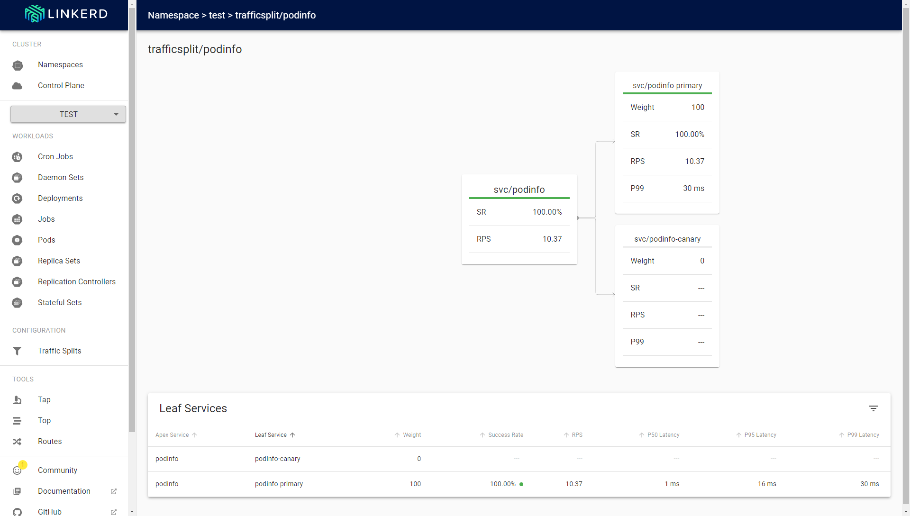
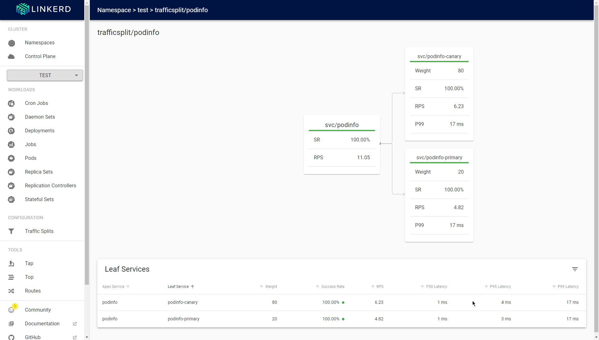

# 5.01

## Installing

```sh
kekalainen@Z97:~$ kubectl apply -f ./dummysite/manifests/
clusterrole.rbac.authorization.k8s.io/dummysite-controller created
clusterrolebinding.rbac.authorization.k8s.io/dummysite-controller created
customresourcedefinition.apiextensions.k8s.io/dummysites.kekalainen.me created
deployment.apps/dummysite-controller created
serviceaccount/dummysite-controller created
```

## Testing

```sh
kekalainen@Z97:~$ kubectl apply -f ./dummysite/test-manifests/
namespace/dwk created
dummysite.kekalainen.me/dwk created
dummysite.kekalainen.me/example created
```

```sh
kekalainen@Z97:~$ kubectl get pods | grep dummysite
dummysite-controller-776bdd7c6f-n5kk5   1/1     Running   0          103s
kekalainen@Z97:~$ kubectl logs dummysite-controller-776bdd7c6f-n5kk5
Waiting for Pods to load
Checking consistency for existing DummySites
Opening a watch for DummySites (resource version 127263)
DymmySite "dwk" added
DymmySite "example" added
Creating a Pod for URL "https://devopswithkubernetes.com" to namespace "dwk"
Creating Service "dwk" to namespace "dwk"
Creating Ingress "dwk" to namespace "dwk"
Creating a Pod for URL "https://example.com/" to namespace "default"
Creating Service "example" to namespace "default"
Creating Ingress "example" to namespace "default"
```

```sh
kekalainen@Z97:~$ kubectl get ingresses
NAME      CLASS    HOSTS   ADDRESS                            PORTS   AGE
example   <none>   *       172.25.0.2,172.25.0.3,172.25.0.4   80      114s
kekalainen@Z97:~$ curl http://localhost:8081/example
<!doctype html>
<html>
<head>
    <title>Example Domain</title>
...
kekalainen@Z97:~$ curl http://localhost:8081/dwk
<!DOCTYPE html><html lang="fi">
...
```

```sh
kekalainen@Z97:~$ kubectl delete -f ./dummysite/test-manifests/
namespace "dwk" deleted
dummysite.kekalainen.me "dwk" deleted
dummysite.kekalainen.me "example" deleted
```

```sh
kekalainen@Z97:~$ kubectl logs dummysite-controller-776bdd7c6f-n5kk5
...
DymmySite "dwk" deleted
Deleting Pod "dwk-6gl6m" from namespace "dwk"
Deleting Service "dwk" from namespace "dwk"
Deleting Ingress "dwk" from namespace "dwk"
DymmySite "example" deleted
Deleting Pod "example-wwmwb" from namespace "default"
Deleting Service "example" from namespace "default"
Deleting Ingress "example" from namespace "default"
```

```sh
kekalainen@Z97:~$ kubectl get ingresses
No resources found in default namespace.
kekalainen@Z97:~$ curl http://localhost:8081/example
404 page not found
```

## 5.02

### Installing Linkerd CLI

```sh
kekalainen@Z97:~$ curl -sL https://run.linkerd.io/install | sh
...
kekalainen@Z97:~$ echo 'export PATH=$PATH:$HOME/.linkerd2/bin' >> ~/.bashrc
```

### Creating manifests

The following commands were used to create the new manifests in the [uh-kube-cluster-dwk](https://github.com/kekalainen/uh-kube-cluster-dwk/tree/5.02) repository.

```sh
kekalainen@Z97:~$ linkerd install > linkerd.yaml
kekalainen@Z97:~$ linkerd install | kubectl apply -f -
...
kekalainen@Z97:~$ linkerd viz install > linkerd-viz.yaml
```

Additionally, the `project` namespace is now explicitly defined with the `linkerd.io/inject` annotation set to `enabled` (see commits).

## 5.03

What follows is a log from doing the [Automated Canary Releases](https://linkerd.io/2.10/tasks/canary-release/) task from [Linkerd](https://linkerd.io).

### Installing Flagger

```sh
kekalainen@Z97:~$ kubectl apply -k github.com/fluxcd/flagger/kustomize/linkerd
customresourcedefinition.apiextensions.k8s.io/alertproviders.flagger.app created
customresourcedefinition.apiextensions.k8s.io/canaries.flagger.app created
customresourcedefinition.apiextensions.k8s.io/metrictemplates.flagger.app created
serviceaccount/flagger created
clusterrole.rbac.authorization.k8s.io/flagger created
clusterrolebinding.rbac.authorization.k8s.io/flagger created
deployment.apps/flagger created
kekalainen@Z97:~$ kubectl -n linkerd rollout status deploy/flagger
deployment "flagger" successfully rolled out
```

### Setting up the demo

```sh
kekalainen@Z97:~$ curl https://run.linkerd.io/flagger.yml
---
apiVersion: apps/v1
kind: Deployment
metadata:
  name: load
  namespace: test
spec:
  selector:
    matchLabels:
      app: load
  replicas: 1
  template:
    metadata:
      annotations:
        linkerd.io/inject: enabled
      labels:
        app: load
    spec:
      containers:
      - image: buoyantio/slow_cooker:1.2.0
        name: slow-cooker
        env:
          - name: QPS
            value: "10"
          - name: CONCURRENCY
            value: "1"
        command: ["/bin/sh", "-c"]
        args:
          - |-
            slow_cooker -qps ${QPS} -concurrency ${CONCURRENCY} http://podinfo:9898
---
apiVersion: v1
kind: ConfigMap
metadata:
  name: frontend
  namespace: test
data:
 nginx.conf: |-
    events {}
    http {
        server {
          listen 8080;
            location / {
                proxy_pass http://podinfo:9898;
            }
        }
    }
---
apiVersion: apps/v1
kind: Deployment
metadata:
  name: frontend
  namespace: test
  labels:
    app: frontend
spec:
  selector:
    matchLabels:
      app: frontend
  replicas: 1
  template:
    metadata:
      annotations:
        linkerd.io/inject: enabled
      labels:
        app: frontend
    spec:
      containers:
        - name: nginx
          image: nginx:alpine
          volumeMounts:
            - name: cfg
              mountPath: /etc/nginx/nginx.conf
              subPath: nginx.conf
      volumes:
        - name: cfg
          configMap:
            name: frontend
---
apiVersion: v1
kind: Service
metadata:
  name: frontend
  namespace: test
spec:
  ports:
  - name: service
    port: 8080
  selector:
    app: frontend
---
apiVersion: apps/v1
kind: Deployment
metadata:
  name: podinfo
  namespace: test
  labels:
    app: podinfo
spec:
  selector:
    matchLabels:
      app: podinfo
  template:
    metadata:
      annotations:
        linkerd.io/inject: enabled
      labels:
        app: podinfo
    spec:
      containers:
      - name: podinfod
        image: quay.io/stefanprodan/podinfo:1.7.0
        imagePullPolicy: IfNotPresent
        ports:
        - containerPort: 9898
        command:
        - ./podinfo
        - --port=9898
---
apiVersion: v1
kind: Service
metadata:
  name: podinfo
  namespace: test
  labels:
    app.kubernetes.io/name: loadtester
    app.kubernetes.io/instance: flagger
spec:
  type: ClusterIP
  ports:
    - port: 9898
  selector:
    app: podinfo
---
```

```sh
kekalainen@Z97:~$ kubectl create ns test && kubectl apply -f https://run.linkerd.io/flagger.yml
namespace/test created
deployment.apps/load created
configmap/frontend created
deployment.apps/frontend created
service/frontend created
deployment.apps/podinfo created
service/podinfo created
kekalainen@Z97:~$ kubectl -n test rollout status deploy podinfo
Waiting for deployment "podinfo" rollout to finish: 0 of 1 updated replicas are available...
deployment "podinfo" successfully rolled out
```

```sh
kekalainen@Z97:~$ kubectl -n test port-forward svc/frontend 8080
Forwarding from 127.0.0.1:8080 -> 8080
Forwarding from [::1]:8080 -> 8080
kekalainen@Z97:~$ curl http://localhost:8080/
{
  "hostname": "podinfo-7bfd46f477-g7cpw",
  "version": "1.7.0",
  "revision": "4fc593f42c7cd2e7319c83f6bfd3743c05523883",
  "color": "blue",
  "message": "greetings from podinfo v1.7.0",
  "goos": "linux",
  "goarch": "amd64",
  "runtime": "go1.11.2",
  "num_goroutine": "7",
  "num_cpu": "4"
}
```

### Configuring the demo for a canary release

```sh
kekalainen@Z97:~$ cat <<EOF | kubectl apply -f -
> apiVersion: flagger.app/v1beta1
> kind: Canary
> metadata:
>   name: podinfo
>   namespace: test
c:
  ta> spec:
>   targetRef:
>     apiVersion: apps/v1
yment
    name: podinf>     kind: Deployment
>     name: podinfo
>   service:
>     port: 9898
analysis>   analysis:
>     interval: 10s
eshold:>     threshold: 5
>     stepWeight: 10
>     maxWeight: 100
>     metrics:
>     - name: request-success-rate
>       thresholdRange:
>         min: 99
>       interval: 1m
>     - name: request-duration
>       thresholdRange:
   max:>         max: 500
>       interval: 1m
> EOF
canary.flagger.app/podinfo created
```

```sh
kekalainen@Z97:~$ kubectl -n test get ev --watch
LAST SEEN   TYPE      REASON              OBJECT                                  MESSAGE
...
10s         Normal    Synced              canary/podinfo                          all the metrics providers are available!
10s         Warning   Synced              canary/podinfo                          podinfo-primary.test not ready: waiting for rollout to finish: observed deployment generation less then desired generation
10s         Normal    ScalingReplicaSet   deployment/podinfo-primary              Scaled up replica set podinfo-primary-5d8b9c4c9f to 1
10s         Normal    Injected            deployment/podinfo-primary              Linkerd sidecar proxy injected
10s         Normal    SuccessfulCreate    replicaset/podinfo-primary-5d8b9c4c9f   Created pod: podinfo-primary-5d8b9c4c9f-4xsw5
9s          Normal    Scheduled           pod/podinfo-primary-5d8b9c4c9f-4xsw5    Successfully assigned test/podinfo-primary-5d8b9c4c9f-4xsw5 to k3d-k3s-default-agent-0
9s          Normal    Pulled              pod/podinfo-primary-5d8b9c4c9f-4xsw5    Container image "cr.l5d.io/linkerd/proxy-init:v1.3.11" already present on machine
9s          Normal    Created             pod/podinfo-primary-5d8b9c4c9f-4xsw5    Created container linkerd-init
9s          Normal    Started             pod/podinfo-primary-5d8b9c4c9f-4xsw5    Started container linkerd-init
0s          Warning   Synced              canary/podinfo                          podinfo-primary.test not ready: waiting for rollout to finish: 0 of 1 updated replicas are available
0s          Normal    Pulled              pod/podinfo-primary-5d8b9c4c9f-4xsw5    Successfully pulled image "quay.io/stefanprodan/podinfo:1.7.0" in 9.9494819s
0s          Normal    Created             pod/podinfo-primary-5d8b9c4c9f-4xsw5    Created container podinfod
0s          Normal    Started             pod/podinfo-primary-5d8b9c4c9f-4xsw5    Started container podinfod
0s          Normal    Pulled              pod/podinfo-primary-5d8b9c4c9f-4xsw5    Container image "cr.l5d.io/linkerd/proxy:stable-2.10.2" already present on machine
0s          Normal    Created             pod/podinfo-primary-5d8b9c4c9f-4xsw5    Created container linkerd-proxy
0s          Normal    Started             pod/podinfo-primary-5d8b9c4c9f-4xsw5    Started container linkerd-proxy
0s          Normal    Synced              canary/podinfo                          all the metrics providers are available!
0s          Warning   Synced              canary/podinfo                          podinfo-primary.test not ready: waiting for rollout to finish: 0 of 1 updated replicas are available
0s          Normal    Synced              canary/podinfo                          all the metrics providers are available!
0s          Normal    ScalingReplicaSet   deployment/podinfo                      Scaled down replica set podinfo-7bfd46f477 to 0
0s          Normal    Killing             pod/podinfo-7bfd46f477-g7cpw            Stopping container podinfod
0s          Normal    SuccessfulDelete    replicaset/podinfo-7bfd46f477           Deleted pod: podinfo-7bfd46f477-g7cpw
0s          Normal    Killing             pod/podinfo-7bfd46f477-g7cpw            Stopping container linkerd-proxy
0s          Normal    Synced              canary/podinfo                          Initialization done! podinfo.test
kekalainen@Z97:~$ kubectl -n test get svc
NAME              TYPE        CLUSTER-IP     EXTERNAL-IP   PORT(S)    AGE
frontend          ClusterIP   10.43.23.239   <none>        8080/TCP   20m
podinfo-canary    ClusterIP   10.43.249.31   <none>        9898/TCP   13m
podinfo-primary   ClusterIP   10.43.77.153   <none>        9898/TCP   13m
podinfo           ClusterIP   10.43.13.254   <none>        9898/TCP   20m
```

### Rolling out a new version

```sh
kekalainen@Z97:~$ kubectl -n test set image deployment/podinfo podinfod=quay.io/stefanprodan/podinfo:1.7.1
deployment.apps/podinfo image updated
```

```sh
kekalainen@Z97:~$ kubectl -n test get ev --watch
LAST SEEN   TYPE      REASON              OBJECT                                  MESSAGE
...
0s          Normal    Synced              canary/podinfo                          New revision detected! Scaling up podinfo.test
0s          Normal    ScalingReplicaSet   deployment/podinfo                      Scaled up replica set podinfo-69c49997fd to 1
1s          Normal    SuccessfulCreate    replicaset/podinfo-69c49997fd           Created pod: podinfo-69c49997fd-vr589
1s          Normal    Injected            deployment/podinfo                      Linkerd sidecar proxy injected
0s          Normal    Scheduled           pod/podinfo-69c49997fd-vr589            Successfully assigned test/podinfo-69c49997fd-vr589 to k3d-k3s-default-server-0
0s          Normal    Pulled              pod/podinfo-69c49997fd-vr589            Container image "cr.l5d.io/linkerd/proxy-init:v1.3.11" already present on machine
0s          Normal    Created             pod/podinfo-69c49997fd-vr589            Created container linkerd-init
0s          Normal    Started             pod/podinfo-69c49997fd-vr589            Started container linkerd-init
0s          Normal    Pulling             pod/podinfo-69c49997fd-vr589            Pulling image "quay.io/stefanprodan/podinfo:1.7.1"
0s          Warning   Synced              canary/podinfo                          canary deployment podinfo.test not ready: waiting for rollout to finish: 0 of 1 updated replicas are available
0s          Normal    Pulled              pod/podinfo-69c49997fd-vr589            Successfully pulled image "quay.io/stefanprodan/podinfo:1.7.1" in 7.3331944s
0s          Normal    Created             pod/podinfo-69c49997fd-vr589            Created container podinfod
0s          Normal    Started             pod/podinfo-69c49997fd-vr589            Started container podinfod
0s          Normal    Pulled              pod/podinfo-69c49997fd-vr589            Container image "cr.l5d.io/linkerd/proxy:stable-2.10.2" already present on machine
0s          Normal    Created             pod/podinfo-69c49997fd-vr589            Created container linkerd-proxy
0s          Normal    Started             pod/podinfo-69c49997fd-vr589            Started container linkerd-proxy
0s          Warning   Synced              canary/podinfo                          canary deployment podinfo.test not ready: waiting for rollout to finish: 0 of 1 updated replicas are available
0s          Normal    Synced              canary/podinfo                          Starting canary analysis for podinfo.test
0s          Normal    Synced              canary/podinfo                          Advance podinfo.test canary weight 10
0s          Normal    Synced              canary/podinfo                          Advance podinfo.test canary weight 20
0s          Normal    Synced              canary/podinfo                          Advance podinfo.test canary weight 30
0s          Normal    Synced              canary/podinfo                          Advance podinfo.test canary weight 40
0s          Normal    Synced              canary/podinfo                          Advance podinfo.test canary weight 50
0s          Normal    Synced              canary/podinfo                          Advance podinfo.test canary weight 60
0s          Normal    Synced              canary/podinfo                          Advance podinfo.test canary weight 70
0s          Normal    Synced              canary/podinfo                          (combined from similar events): Advance podinfo.test canary weight 80
0s          Normal    Synced              canary/podinfo                          (combined from similar events): Advance podinfo.test canary weight 90
0s          Normal    Synced              canary/podinfo                          (combined from similar events): Advance podinfo.test canary weight 100
0s          Normal    Synced              canary/podinfo                          (combined from similar events): Copying podinfo.test template spec to podinfo-primary.test
0s          Normal    ScalingReplicaSet   deployment/podinfo-primary              Scaled up replica set podinfo-primary-7c5b847cc4 to 1
0s          Normal    Injected            deployment/podinfo-primary              Linkerd sidecar proxy injected
0s          Normal    SuccessfulCreate    replicaset/podinfo-primary-7c5b847cc4   Created pod: podinfo-primary-7c5b847cc4-m87bz
0s          Normal    Scheduled           pod/podinfo-primary-7c5b847cc4-m87bz    Successfully assigned test/podinfo-primary-7c5b847cc4-m87bz to k3d-k3s-default-agent-1
0s          Normal    Pulled              pod/podinfo-primary-7c5b847cc4-m87bz    Container image "cr.l5d.io/linkerd/proxy-init:v1.3.11" already present on machine
0s          Normal    Created             pod/podinfo-primary-7c5b847cc4-m87bz    Created container linkerd-init
0s          Normal    Started             pod/podinfo-primary-7c5b847cc4-m87bz    Started container linkerd-init
0s          Normal    Pulling             pod/podinfo-primary-7c5b847cc4-m87bz    Pulling image "quay.io/stefanprodan/podinfo:1.7.1"
0s          Normal    Pulled              pod/podinfo-primary-7c5b847cc4-m87bz    Successfully pulled image "quay.io/stefanprodan/podinfo:1.7.1" in 6.4051517s
0s          Normal    Created             pod/podinfo-primary-7c5b847cc4-m87bz    Created container podinfod
0s          Normal    Started             pod/podinfo-primary-7c5b847cc4-m87bz    Started container podinfod
0s          Normal    Pulled              pod/podinfo-primary-7c5b847cc4-m87bz    Container image "cr.l5d.io/linkerd/proxy:stable-2.10.2" already present on machine
0s          Normal    Created             pod/podinfo-primary-7c5b847cc4-m87bz    Created container linkerd-proxy
0s          Normal    Started             pod/podinfo-primary-7c5b847cc4-m87bz    Started container linkerd-proxy
0s          Warning   Synced              canary/podinfo                          podinfo-primary.test not ready: waiting for rollout to finish: 1 old replicas are pending termination
0s          Warning   Synced              canary/podinfo                          podinfo-primary.test not ready: waiting for rollout to finish: 1 old replicas are pending termination
0s          Normal    ScalingReplicaSet   deployment/podinfo-primary              Scaled down replica set podinfo-primary-5d8b9c4c9f to 0
0s          Normal    SuccessfulDelete    replicaset/podinfo-primary-5d8b9c4c9f   Deleted pod: podinfo-primary-5d8b9c4c9f-4xsw5
1s          Normal    Killing             pod/podinfo-primary-5d8b9c4c9f-4xsw5    Stopping container podinfod
1s          Normal    Killing             pod/podinfo-primary-5d8b9c4c9f-4xsw5    Stopping container linkerd-proxy
0s          Normal    Synced              canary/podinfo                          (combined from similar events): Routing all traffic to primary
0s          Normal    ScalingReplicaSet   deployment/podinfo                      Scaled down replica set podinfo-69c49997fd to 0
0s          Normal    Synced              canary/podinfo                          (combined from similar events): Promotion completed! Scaling down podinfo.test
0s          Normal    SuccessfulDelete    replicaset/podinfo-69c49997fd           Deleted pod: podinfo-69c49997fd-vr589
0s          Normal    Killing             pod/podinfo-69c49997fd-vr589            Stopping container podinfod
0s          Normal    Killing             pod/podinfo-69c49997fd-vr589            Stopping container linkerd-proxy
0s          Warning   Unhealthy           pod/podinfo-69c49997fd-vr589            Liveness probe failed: Get "http://10.42.0.19:4191/live": dial tcp 10.42.0.19:4191: connect: connection refused
0s          Warning   Unhealthy           pod/podinfo-69c49997fd-vr589            Readiness probe failed: Get "http://10.42.0.19:4191/ready": dial tcp 10.42.0.19:4191: connect: connection refused
```

```sh
kekalainen@Z97:~$ curl http://localhost:8080/
{
  "hostname": "podinfo-primary-5d8b9c4c9f-4xsw5",
  "version": "1.7.0",
  "revision": "4fc593f42c7cd2e7319c83f6bfd3743c05523883",
  "color": "blue",
  "message": "greetings from podinfo v1.7.0",
  "goos": "linux",
  "goarch": "amd64",
  "runtime": "go1.11.2",
  "num_goroutine": "7",
  "num_cpu": "4"
}
kekalainen@Z97:~$ curl http://localhost:8080/
{
  "hostname": "podinfo-69c49997fd-vr589",
  "version": "1.7.1",
  "revision": "c9dc78f29c5087e7c181e58a56667a75072e6196",
  "color": "blue",
  "message": "greetings from podinfo v1.7.1",
  "goos": "linux",
  "goarch": "amd64",
  "runtime": "go1.11.12",
  "num_goroutine": "7",
  "num_cpu": "4"
}
```

```sh
kekalainen@Z97:~$ kubectl -n test get canary
NAME      STATUS      WEIGHT   LASTTRANSITIONTIME
podinfo   Succeeded   0        2021-07-11T04:54:25Z
kekalainen@Z97:~$ kubectl -n test get trafficsplit podinfo -o yaml
apiVersion: split.smi-spec.io/v1alpha2
kind: TrafficSplit
...
spec:
  backends:
  - service: podinfo-canary
    weight: "0"
  - service: podinfo-primary
    weight: "100"
  service: podinfo
kekalainen@Z97:~$ linkerd viz -n test stat deploy --from deploy/load
NAME              MESHED   SUCCESS       RPS   LATENCY_P50   LATENCY_P95   LATENCY_P99   TCP_CONN
podinfo              0/0         -         -             -             -             -          -
podinfo-primary      1/1   100.00%   10.0rps           1ms           1ms           8ms          1
```



### Rolling out the previous version

```sh
kekalainen@Z97:~$ kubectl -n test set image deployment/podinfo podinfod=quay.io/stefanprodan/podinfo:1.7.0
deployment.apps/podinfo image updated
```



### Cleaning up

```sh
kekalainen@Z97:~$ kubectl delete -k github.com/fluxcd/flagger/kustomize/linkerd && kubectl delete ns test
customresourcedefinition.apiextensions.k8s.io "alertproviders.flagger.app" deleted
customresourcedefinition.apiextensions.k8s.io "canaries.flagger.app" deleted
customresourcedefinition.apiextensions.k8s.io "metrictemplates.flagger.app" deleted
serviceaccount "flagger" deleted
clusterrole.rbac.authorization.k8s.io "flagger" deleted
clusterrolebinding.rbac.authorization.k8s.io "flagger" deleted
deployment.apps "flagger" deleted
namespace "test" deleted
```
